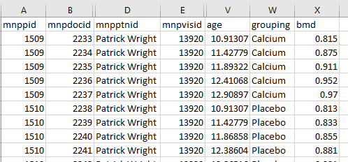

# Linking data among export files

SecuTrial creates a large number of identifiers and it is not immediately obvious how the tables all fit together. This recipe is intended to provide those links. 

This information will mostly be of use to those analysing the data.

## The data itself

Below is a typical header for an export from SecuTrial. Note that I have hidden a lot of the system variables. They are not relevant to this recipe.

There are four IDs in this table. `mnppid`, `mnpdocid`, `mnpptnid` and `mnpvisid`. A description of these, and some others are included in the following table.

ID name | Description
--------|--------------
`mnppid` | main participant ID
`mnpdocid` | every single page in secuTrial is assigned a document ID
`mnpptnid` | person that entered the data
`mnpvisid` | visit identifier
`mnpsubdocid` | forms with repeating elements produce their own forms

Not all tables will include a visit identifier or `mnpsubdocid`.

The primary link is the `mnppid`. This is SecuTrial internal identifier for a participant. There are secondary identifiers too - `mnpaid` is the additional identifier and is the one shown in the web interface for SecuTrial.

## Metadata

